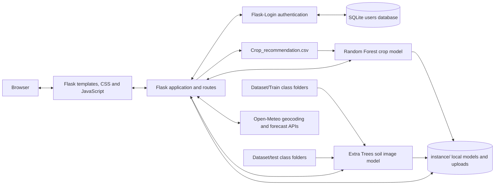

# PlantSphere

PlantSphere is a local Flask web application for crop recommendations, soil-image classification, and current weather lookups. It combines agricultural datasets and lightweight machine-learning models with a browser-based field dashboard.

## Functional Requirements

### Accounts and access

- **FR-01:** A visitor can create an account with a unique username and a password of at least eight characters.
- **FR-02:** Passwords are stored as hashes in a local SQLite database; a registered user can sign in and sign out.
- **FR-03:** The dashboard and crop, soil, and weather tools require authentication.

### Crop recommendation

- **FR-04:** An authenticated user can enter nitrogen (N), phosphorus (P), potassium (K), temperature, humidity, soil pH, and rainfall.
- **FR-05:** The application validates the inputs and predicts a crop using a Random Forest trained on `Crop_recommendation.csv`.
- **FR-06:** The application returns the predicted crop and the model's prediction confidence.
- **FR-07:** The crop model is trained on the first prediction when no saved model exists; the generated model is stored locally.

### Soil-image classification

- **FR-08:** An authenticated user can upload a PNG, JPG, JPEG, or WEBP soil image no larger than 8 MB.
- **FR-09:** The application classifies the image as Alluvial, Black, Clay, or Red soil and displays prediction confidence and crop suggestions associated with that soil class.
- **FR-10:** The soil classifier is trained from the class folders in `Dataset/Train` and evaluated using the separate `Dataset/test` split.
- **FR-11:** The application trains and saves the soil model on the first upload when a saved model is not available. A user can retrain it with `train_soil_classifier.py`.
- **FR-12:** The interface identifies model confidence as an estimate, not a guarantee or a replacement for laboratory soil analysis.

### Weather lookup

- **FR-13:** An authenticated user can request current weather by entering a town or city name.
- **FR-14:** The application displays the matched location, temperature, feels-like temperature, humidity, precipitation, wind speed, and condition when available.
- **FR-15:** Weather lookup uses Open-Meteo and requires an internet connection; no API key is required.

## System Architecture



### Component responsibilities

- `app.py` defines Flask routes, account handling, input validation, and calls to the crop, soil, and weather services.
- `templates/` contains the Jinja pages. `static/app.css` styles the interface and `static/app.js` submits crop and soil forms without a full page reload.
- `soil_model.py` extracts resized RGB/HSV pixel, histogram, and regional color features; trains an Extra Trees classifier; evaluates it on the held-out test split; and saves/loads the model.
- `weather/weather.py` resolves a place with Open-Meteo geocoding and fetches its current conditions.
- `instance/` is created locally for the SQLite database, generated model files, and uploaded files. It is excluded from source control.

### Machine-learning data flow

1. Crop inputs are checked, then passed to a Random Forest trained on `Crop_recommendation.csv`. The model is saved as `instance/crop_model.joblib`.
2. Soil training reads labelled images from `Dataset/Train/<class>/`, extracts image features, and fits an Extra Trees classifier. `Dataset/test/<class>/` is used only for evaluation. The model and test metrics are saved as `instance/soil_model.joblib`.
3. A soil upload is converted to the same image features and classified by the saved soil model. If no model exists, the application trains one before classifying the upload.

The soil classifier uses hand-crafted pixel and color features rather than a CNN. Test accuracy measures performance on this dataset split and should not be interpreted as a guarantee for every camera, soil sample, or field condition.

## Technology Stack

- Python 3.9 or newer
- Flask and Flask-Login
- scikit-learn, NumPy, pandas, and joblib
- Pillow for image loading and preprocessing
- SQLite for local accounts
- HTML, CSS, JavaScript, and Jinja templates
- Open-Meteo APIs for weather

## Run Locally

### Prerequisites

- Python 3.9 or newer installed and available on `PATH` (`py -0p` lists Python versions on Windows).
- Internet access for the weather feature and Google Fonts. Crop and soil predictions use local data after the project is installed.

### Windows PowerShell

Clone the repository and enter its folder:

```powershell
git clone https://github.com/Samia5038/PlantSphere.git
cd PlantSphere
```

Create a virtual environment, install dependencies, and start the Flask server:

```powershell
py -3.9 -m venv .venv
.\.venv\Scripts\python.exe -m pip install -r requirements.txt
.\.venv\Scripts\python.exe app.py
```

Open **http://127.0.0.1:5000** in a browser. Create an account on the landing page to use the tools. The first crop prediction trains the crop model; the first soil-image upload trains and evaluates the soil model. These first requests can take longer than subsequent requests.

To train/evaluate the soil model manually before starting the app:

```powershell
.\.venv\Scripts\python.exe train_soil_classifier.py
```

To stop the local server, press `Ctrl+C` in the terminal running Flask. In VS Code, select `.venv\Scripts\python.exe` as the workspace Python interpreter.

## Deploy Live on Render

The repository includes a Render Blueprint in `render.yaml`. It configures the Python web service, health check, generated Flask secret, and a persistent disk mounted at `/var/data`. A paid Render Starter web service is required because the SQLite accounts and trained models must survive restarts; Render's free web service does not provide a persistent disk.

1. Sign in to [Render](https://render.com/) and connect the GitHub account that can access `Samia5038/PlantSphere`.
2. In the Render dashboard, select **New +** and then **Blueprint**.
3. Choose the `Samia5038/PlantSphere` repository and the `main` branch.
4. Render reads `render.yaml`. Review the `plantsphere` web service and its persistent disk, then select **Apply**. Confirm the paid Starter plan and disk when prompted.
5. Wait for the first build and deploy to finish. Render installs `requirements.txt`, starts Gunicorn, and checks `/health`.
6. Open the `onrender.com` URL shown on the service page and create an account in PlantSphere.
7. Open **Events** and **Logs** if the deploy fails. The first soil classification trains the model and may take longer than later uploads.

The Blueprint generates `PLANTSPHERE_SECRET_KEY` and sets `PLANTSPHERE_DATA_DIR=/var/data`; do not replace these with local paths. Weather lookups need outbound internet access. To deploy a later GitHub change, push it to `main`; Render will rebuild the service automatically.

## Project Layout

```text
PlantSphere/
|-- app.py
|-- soil_model.py
|-- train_soil_classifier.py
|-- Crop_recommendation.csv
|-- Dataset/
|   |-- Train/<soil-class>/
|   `-- test/<soil-class>/
|-- templates/
|-- static/
|-- weather/
|-- requirements.txt
`-- instance/                 # generated locally; not committed
```

## Limitations and Future Work

- The soil classifier is trained and evaluated on the supplied image dataset; external validation on diverse real-world samples is still needed.
- Soil classification and crop suggestions are decision-support information, not agricultural, laboratory, or yield guarantees.
- Weather data is current-condition information, not a complete forecast or a substitute for local advisories.
- Possible next steps include broader datasets, explainable predictions, soil-sensor integrations, and forecast-aware recommendations.

## Author

**Samia Mahbub**<br>
Department of Computer Science and Engineering<br>
University of Chittagong

[GitHub Repository](https://github.com/Samia5038/PlantSphere)
